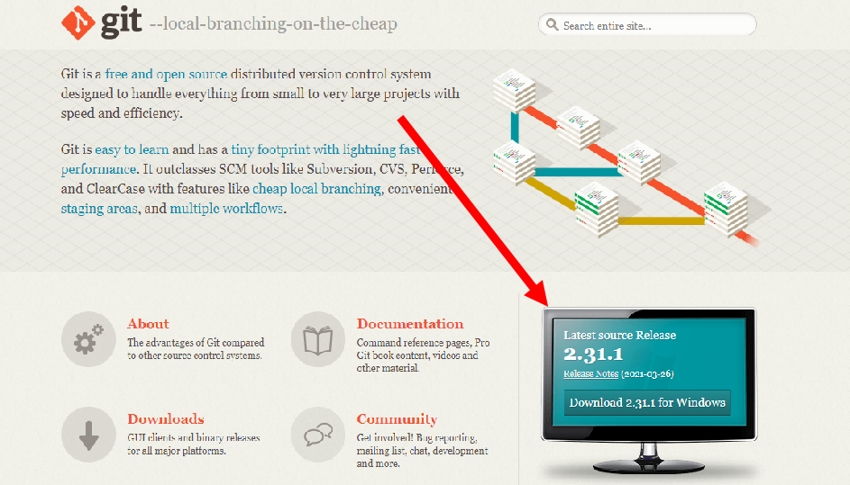
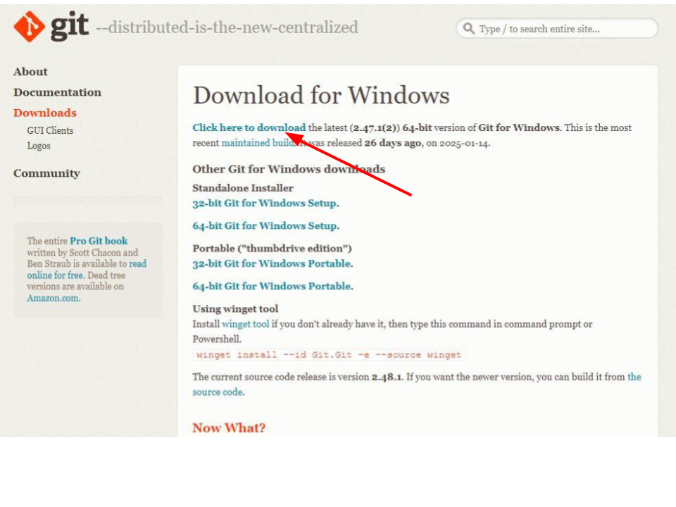

### [Princeton STEM Academy](../../index.md)

## Install and Configure the “Git” Version Control Tool

_Git_ is perhaps the most popular software version control tool in use today.  You don’t absolutely need it to learn how to program, but you will need it to participate in FIRST Tech Challenge robot programming as part of a team.

### Download the Installer - Windows

Go to the Git website, here: [https://git-scm.com/](https://git-scm.com/){:target="\_blank" rel="noopener"}.  The _Latest Source Release_ icon should list the installer for your operating system (Windows or Mac).  The monitor image should show the correct Git version for your computer.

Click the button on the "monitor".



The next screen should offer you the option of several different installers. Click on the default; your download should start automatically.



### Run the Installer - Windows

From your Downloads folder, double-click on the Git Installer file to start it running.  Accept the license, and click through every screen offering changes to default options.  **Do not change any defaults; leave them as they are.**  Just click through every screen (there are quite a few).  It won’t take long.  (The final screen will offer to show you the release notes.  You don’t need to read them.)

### Install Git - Mac

Apple maintains its own version of Git, as part of the *developer tools*. If they are not already installed on your Mac, you will have to install the Apple package.

To do so, open the "Terminal" app.

Then, enter (or copy and paste) this command:

    git --version

If you get a Git version response, great. Otherwise, your Mac should start a dialog offering to install the iOS (Apple) developer tools. Respond appropriately to install the developer tools on your computer. This may take a while; there's a lot to download and install.

### Configure Git - Windows or Mac

Open a Command Prompt (Mac: Terminal) window.  You will now set a default editor for “commit” messages in the rare event you need to do that from a command line.  You will also set a default user name for your machine, and a default e-mail address.  These can be changed at any time.

**Do not enter both commands. Select the one appropriate for your computer.**

Enter, for Windows:

    git config --global core.editor notepad

Or, for a Mac, enter:

    git config --global core.editor TextEdit

Neither command will report successful completion; you’ll just get another prompt.  Now, set your name and e-mail address, substituting your information for Max.  (n.b.: Max is one of the scientists from “Avatar”.)

These are two separate commands. Copy, paste, and edit them one at a time. Use only your backspace and arrow keys to edit these lines; your mouse or touchpad may not work correctly.

**WARNING: Read completely through the rest of this section before you Copy and Paste the commands.**

**Important: After pasting these lines into your Command Prompt (or Terminal) window, backspace over the name / email, *including the quotes*, and type in your own information, again *including the quotes*, before you hit \<Enter\>.**

**You MUST delete and re-type the quote characters.**


```
git config --global user.name "Max Patel"
```


```
git config --global user.email "max@pandora.com"
```

Now, confirm your entries with:

    git config --global --list

Which should show you all three entries (without the quotes).  (You may have to enter “exit” to quit the display.)  That’s it; you’ve got git.  :-)

### Notes

_Git_ is an Open Source project.  Like many such projects, it has an unintuitive name.
Some authorities say that it stands for "Global Information Tracker" - but that's probably an after-the-fact acronym.
(N.B.: An acronym, developed after-the-fact to justify an otherwise mysterious name,
is called a "backronym".)

You don't need to learn much about Git command line functions to use it in FIRST: Android Studio takes care of most Git functions behind the scenes.
However, if you choose to make your career in Software Development, Git command line skills are a useful thing to have on your resume.
There are plenty of text-based and video tutorials to help you.

[_homepage / index_](../../index.md)
